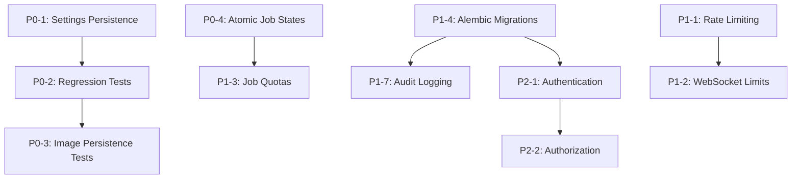

# Implementation Plan: Software Review Recommendations

**Date:** 2026-06-09  
**Based on:** `SOFTWARE_REVIEW_RECOMMENDATIONS.md`  
**Status:** Draft  

---

## Overview

This plan addresses the 15 recommendations from the software review, organized into three priority tiers based on risk, effort, and impact. Each item includes the specific files to modify, the approach, and acceptance criteria.

---

## Priority 0 — Stabilization & Correctness (Do First)

These items address bugs, regressions, and correctness issues that affect current users.

---

### P0-1: Fix ComfyUI Settings Persistence

**Review item:** §2, §5, Risk Register row 1  
**Problem:** ComfyUI settings may not persist after page refresh, causing users to lose workflow configuration and node mappings.  
**Approach:**

1. **Audit `frontend/src/api/comfyuiSettings.js`** — Verify that `saveSettings()` writes to localStorage and `loadSettings()` reads from localStorage correctly. Check for debounce timing issues.
2. **Add persistence tests** — Create `frontend/src/test/comfyuiSettings.test.js` that verifies:
   - Settings saved to localStorage survive a simulated page reload
   - All fields (serverUrl, workflowJson, positiveNodeId, negativeNodeId, seedNodeId, seedInputName) are persisted
   - Empty/undefined values don't overwrite valid saved values
3. **Add a `beforeunload` handler** — Ensure settings are flushed to localStorage before the page unloads, bypassing any debounce timer.
4. **Add a startup consistency check** — On app mount, compare React state with localStorage and reconcile any differences.

**Files to modify:**
- `frontend/src/api/comfyuiSettings.js`
- `frontend/src/App.jsx`
- New: `frontend/src/test/comfyuiSettings.test.js`

**Acceptance criteria:**
- [ ] Settings persist across page refresh in all browsers
- [ ] No settings are lost when navigating between pages
- [ ] Test coverage for all settings fields

---

### P0-2: Add ComfyUI Regression Test Suite

**Review item:** §5  
**Problem:** No automated regression tests for the most failure-prone user flow (prompt → ComfyUI → image display).  
**Approach:**

1. **Create `backend/tests/test_comfyui_regression.py`** with tests for:
   - Workflow patching with correct node IDs → prompts injected correctly
   - Workflow patching with swapped node IDs → auto-detection corrects them
   - Workflow patching with invalid node IDs → auto-detection falls back
   - Seed auto-detection for RandomNoise, KSampler, SamplerCustom
   - `control_after_generate` set to "randomize"
   - UI-to-API workflow conversion preserves all node data
   - SSRF URL validation blocks private IPs
   - SSRF URL validation allows configured hosts

2. **Create a manual regression checklist** in `docs/COMFYUI_REGRESSION_CHECKLIST.md` (the 20-item checklist from §5)

**Files to modify:**
- New: `backend/tests/test_comfyui_regression.py`
- New: `docs/COMFYUI_REGRESSION_CHECKLIST.md`

**Acceptance criteria:**
- [ ] All automated regression tests pass
- [ ] Manual checklist documented and runnable

---

### P0-3: Add Image Persistence Tests

**Review item:** §4.1, §5  
**Problem:** No tests verifying that ComfyUI images are correctly stored by `history_id` and survive page refreshes.  
**Approach:**

1. **Create `backend/tests/test_image_persistence.py`** with tests for:
   - ComfyUI history response parsing
   - Image proxy URL generation
   - `history_id`-based image keying
   - Image metadata storage in database

2. **Create `frontend/src/test/imagePersistence.test.js`** (or add to existing test file) with tests for:
   - `comfyUIImages` state keyed by `history_id`
   - localStorage persistence of `comfyUIImages`
   - No image overwrite when status is 'done'

**Files to modify:**
- New: `backend/tests/test_image_persistence.py`
- New: `frontend/src/test/imagePersistence.test.js`

**Acceptance criteria:**
- [ ] Backend image persistence tests pass
- [ ] Frontend image persistence tests pass

---

### P0-4: Add Atomic LoRA Job State Transitions

**Review item:** §3, Risk Register row 9  
**Problem:** Race conditions in LoRA job start/cancel operations. Two concurrent start requests could launch two training processes.  
**Approach:**

1. **Add state transition validation** in `backend/app/api/lora.py`:
   - Only allow `pending → running` transitions
   - Only allow `running → cancelled` transitions
   - Only allow `running → completed` or `running → failed` transitions
   - Reject any invalid transition with 409 Conflict

2. **Use database-level locking** — Add `SELECT ... FOR UPDATE` when reading job status before state changes, preventing concurrent modifications.

3. **Add idempotency** — If a start request comes for a job that's already running, return the current status instead of starting a duplicate.

**Files to modify:**
- `backend/app/api/lora.py`
- `backend/app/core/training_runner.py`
- `backend/tests/test_lora.py` (add state transition tests)

**Acceptance criteria:**
- [ ] Concurrent start requests don't create duplicate processes
- [ ] Invalid state transitions return 409 Conflict
- [ ] Job state machine is documented

---

### P0-5: Reconcile WebSocket Endpoint Documentation

**Review item:** §8  
**Problem:** The software report lists `/ws/comfyui/{server_url}` but the actual endpoint is `/api/comfyui/ws?clientId=...&server_url=...`.  
**Approach:**

1. **Verify the actual WebSocket endpoint** in `backend/app/api/comfyui.py`
2. **Update `docs/SOFTWARE_REPORT.md`** API reference to show the correct endpoint
3. **Add a note** that the frontend must always connect through the backend proxy, never directly to ComfyUI

**Files to modify:**
- `docs/SOFTWARE_REPORT.md`

**Acceptance criteria:**
- [x] API reference shows correct WebSocket endpoint
- [x] Note about proxy-only connection is included

---

## Priority 1 — Production Readiness (Do Second)

These items are required before the application can be safely deployed for shared or internet-facing use.

---

### P1-1: Add Rate Limiting

**Review item:** §6.2  
**Problem:** No rate limiting on any endpoint. Expensive operations (prompt generation, ComfyUI submission, image upload) are unprotected.  
**Approach:**

1. **Add `slowapi`** to `backend/requirements.txt`
2. **Create `backend/app/core/rate_limiter.py`** with configured limits:
   - Prompt generation: 30/minute
   - ComfyUI submission: 10/minute
   - Image upload: 20/minute
   - General API: 100/minute
   - WebSocket connections: 5/minute per IP
3. **Add rate limiter middleware** in `backend/app/main.py`
4. **Add rate limit headers** to responses (X-RateLimit-Limit, X-RateLimit-Remaining, X-RateLimit-Reset)

**Files to modify:**
- `backend/requirements.txt`
- New: `backend/app/core/rate_limiter.py`
- `backend/app/main.py`
- `backend/app/api/comfyui.py`
- `backend/app/api/prompts.py`
- `backend/app/api/references.py`
- `backend/app/api/lora.py`

**Acceptance criteria:**
- [ ] Rate limits enforced on all expensive endpoints
- [ ] 429 Too Many Requests returned when limits exceeded
- [ ] Rate limit headers included in responses

---

### P1-2: Add WebSocket Connection Limits

**Review item:** §3, Risk Register row 5, §6.2  
**Problem:** No limit on WebSocket connections. An attacker could exhaust backend resources.  
**Approach:**

1. **Add connection tracking** — Maintain a dict of active WebSocket connections per client IP
2. **Enforce max connections per IP** — Default: 3 concurrent connections per IP
3. **Add idle timeout** — Close connections idle for more than 5 minutes
4. **Add max message size** — Limit WebSocket messages to 1MB
5. **Log connection/disconnection events** with client IP and duration

**Files to modify:**
- `backend/app/api/comfyui.py` (WebSocket proxy section)
- New: `backend/app/core/ws_manager.py`

**Acceptance criteria:**
- [x] Max 3 concurrent WebSocket connections per IP
- [x] Idle connections closed after 5 minutes
- [x] Connection/disconnection events logged

---

### P1-3: Add Training Job Quotas and Command Safety

**Review item:** §3, Risk Register row 6, §6.2  
**Problem:** No limits on training jobs. Command templates could be exploited for arbitrary command execution.  
**Approach:**

1. **Add job quotas** — Max 3 concurrent training jobs, max 10 per day per user (currently single-user, but prepare for multi-user)
2. **Add command allowlisting** — Validate that generated training commands start with allowed prefixes (`accelerate launch`, `python run.py`)
3. **Add custom_args sanitization** — Already exists (alphanumeric keys only), but add value length limits
4. **Add subprocess isolation** — Run training in a restricted environment (no network access, resource limits via `ulimit` or cgroups)
5. **Add timeout** — Kill training processes that run longer than 24 hours

**Files to modify:**
- `backend/app/core/training_runner.py`
- `backend/app/api/lora.py`
- `backend/tests/test_training_runner.py`

**Acceptance criteria:**
- [x] Max concurrent jobs enforced
- [x] Command templates validated against allowlist
- [x] Training processes killed after timeout
- [x] Custom args length-limited

---

### P1-4: Adopt Alembic Migrations

**Review item:** §9  
**Problem:** Database schema changes are applied via `init_db()` with ad-hoc ALTER TABLE statements. This is fragile and doesn't support rollback.  
**Approach:**

1. **Install Alembic** — Add `alembic` to `backend/requirements.txt`
2. **Initialize Alembic** — Run `alembic init backend/alembic`
3. **Create initial migration** — Run `alembic revision --autogenerate -m "baseline"` against the current schema
4. **Remove ad-hoc migrations from `init_db()`** — Replace `ALTER TABLE` statements with Alembic-managed migrations
5. **Keep `create_all` as fallback** — For new installations, `create_all` still creates tables, but Alembic handles incremental changes
6. **Add migration commands** to Docker entrypoint and development runbook
7. **Add backup step** — Document `pg_dump` before production migrations

**Files to modify:**
- `backend/requirements.txt`
- `backend/app/db/database.py` (remove ad-hoc ALTER TABLE)
- New: `backend/alembic.ini`
- New: `backend/alembic/` (migration directory)
- New: `backend/alembic/versions/001_baseline.py`
- `docs/SOFTWARE_REPORT.md` (add migration strategy section)

**Acceptance criteria:**
- [x] Alembic initialized with baseline migration
- [x] Ad-hoc ALTER TABLE statements removed from `init_db()`
- [x] `alembic upgrade head` works on fresh and existing databases
- [x] Migration commands documented

---

### P1-5: Add Structured Logging and Observability

**Review item:** §10  
**Problem:** Logging is inconsistent. No structured logs, no metrics, no job-level tracing.  
**Approach:**

1. **Standardize log format** — Use JSON-structured logs with `structlog` or Python `logging` with consistent format
2. **Add key event logs** per the review's §10.1 table:
   - ComfyUI connection test (URL, success/failure, latency)
   - Workflow validation (detected nodes, format)
   - Workflow submission (prompt_id, seed, latency)
   - WebSocket connection/disconnection (client_id, duration)
   - Image history fetch (prompt_id, image count, retries)
   - Reference upload (character_id, file count, rejected count)
   - Training job start/end (job_id, backend, duration, exit code)
   - Security rejections (endpoint, reason, client IP)
3. **Add request ID tracking** — Generate a UUID per request and include it in all log messages for that request
4. **Add basic metrics** — Count ComfyUI submissions, success/failure rates, generation latency (logged, not yet exported to Prometheus)

**Files to modify:**
- `backend/app/main.py` (add request ID middleware)
- `backend/app/api/comfyui.py` (add structured logs)
- `backend/app/api/references.py` (add structured logs)
- `backend/app/api/lora.py` (add structured logs)
- `backend/app/core/training_runner.py` (add structured logs)
- New: `backend/app/core/logging_config.py`

**Acceptance criteria:**
- [x] All key events logged with consistent format
- [x] Request IDs trackable across log messages
- [x] Security rejections logged with client IP and reason

---

### P1-6: Add Storage Quotas and Cleanup Policy

**Review item:** §3, Risk Register row 7  
**Problem:** No limits on reference image storage. Disk can fill over time.  
**Approach:**

1. **Add per-project storage quota** — Default: 500MB per project, configurable via env var
2. **Add per-character image limit** — Default: 100 images per character
3. **Add cleanup API** — `DELETE /api/characters/{id}/references/cleanup` to remove rejected images
4. **Add storage usage endpoint** — `GET /api/storage/usage` returning per-project disk usage
5. **Log storage warnings** — Warn when a project exceeds 80% of quota

**Files to modify:**
- `backend/app/core/storage.py` (add quota checks)
- `backend/app/api/references.py` (add quota enforcement)
- New: `backend/app/api/storage.py` (storage usage endpoint)
- `backend/app/main.py` (register new router)

**Acceptance criteria:**
- [x] Upload rejected when project quota exceeded
- [x] Storage usage endpoint returns per-project disk usage
- [x] Cleanup API removes rejected images from disk

---

### P1-7: Add Audit Logging for Sensitive Operations

**Review item:** §6.2, §10  
**Problem:** No audit trail for uploads, training, exports, and deletions.  
**Approach:**

1. **Create `backend/app/db/database.py` audit_log table** — Columns: id, timestamp, action, resource_type, resource_id, details_json, client_ip
2. **Add audit logging middleware** — Log all POST, PUT, PATCH, DELETE requests
3. **Add specific audit events** for:
   - Reference image upload/delete
   - Training job start/cancel
   - LoRA export
   - Character profile delete
   - ComfyUI submission

**Files to modify:**
- `backend/app/db/database.py` (add audit_log table)
- `backend/app/main.py` (add audit middleware)
- `backend/app/api/references.py`
- `backend/app/api/lora.py`
- `backend/app/api/characters.py`
- `backend/app/api/comfyui.py`

**Acceptance criteria:**
- [x] All sensitive operations logged to audit_log table
- [x] Audit log includes timestamp, action, resource, and client IP
- [ ] Audit log queryable via API (admin only, future)

---

## Priority 2 — Product Enhancements (Do Later)

These items are valuable but not blocking for production deployment.

---

### P2-1: Add Authentication

**Review item:** §6.2, Risk Register row 3  
**Problem:** No authentication. Anyone with network access can use the app.  
**Approach:**

1. **Add `python-jose` and `passlib`** to requirements
2. **Create `backend/app/core/auth.py`** — JWT-based authentication with:
   - `create_access_token()` / `verify_token()`
   - Password hashing with bcrypt
   - Token expiration (default: 24 hours)
3. **Create `backend/app/db/database.py` users table** — id, username, hashed_password, created_at
4. **Create `backend/app/api/auth.py`** — Login, register, token refresh endpoints
5. **Add `get_current_user` dependency** — FastAPI dependency that validates JWT tokens
6. **Protect all endpoints** — Add `Depends(get_current_user)` to all routers except `/api/auth/*` and `/api/health`
7. **Add frontend login page** — Simple username/password form

**Estimated effort:** 3–5 days

---

### P2-2: Add Per-User Authorization

**Review item:** §6.2, Risk Register row 4  
**Problem:** No user isolation. In multi-user mode, all users see all data.  
**Approach:**

1. **Add `owner_id` column** to all database tables (presets, prompt_history, character_profiles, reference_images, lora_jobs)
2. **Add `owner_id` filter** to all queries — Users can only see their own data
3. **Add ownership checks** to all update/delete endpoints
4. **Add Alembic migration** for the new columns

**Estimated effort:** 2–3 days (depends on P2-1)

---

### P2-3: Sprite Sheet Generation

**Review item:** §10 in original MVP plan  
**Problem:** No automatic sprite sheet arrangement.  
**Approach:**

1. **Create `backend/app/core/sprite_sheet.py`** — Arrange individual sprites into a grid
2. **Add `POST /api/sprite-sheet` endpoint** — Accept list of image paths, rows, columns, padding
3. **Add frontend sprite sheet component** — Preview and download sprite sheets

**Estimated effort:** 3–5 days

---

### P2-4: Background Removal

**Review item:** §10 in original MVP plan  
**Approach:**

1. **Integrate `rembg`** or similar library for automatic background removal
2. **Add `POST /api/characters/{id}/references/{img_id}/remove-background` endpoint**
3. **Add frontend button** on each reference image

**Estimated effort:** 2–3 days

---

### P2-5: Batch ComfyUI Queue Management

**Review item:** §10 in original MVP plan  
**Problem:** Batch submissions send prompts sequentially with a delay, but there's no queue management.  
**Approach:**

1. **Create `backend/app/core/comfyui_queue.py`** — Priority queue for ComfyUI submissions
2. **Add queue status endpoint** — `GET /api/comfyui/queue`
3. **Add cancel endpoint** — `DELETE /api/comfyui/queue/{id}`
4. **Add queue management UI** — Show pending/running/completed jobs

**Estimated effort:** 3–5 days

---

## Implementation Timeline

### Week 1–2: P0 Stabilization

| Task | Effort | Priority |
|------|--------|----------|
| P0-1: Fix ComfyUI settings persistence | 1 day | Critical |
| P0-2: Add ComfyUI regression test suite | 1 day | Critical |
| P0-3: Add image persistence tests | 0.5 day | High |
| P0-4: Add atomic LoRA job state transitions | 1 day | High |
| P0-5: Reconcile WebSocket endpoint docs | 0.5 day | Medium |

### Week 3–5: P1 Production Readiness

| Task | Effort | Priority |
|------|--------|----------|
| P1-1: Add rate limiting | 1 day | High |
| P1-2: Add WebSocket connection limits | 1 day | High |
| P1-3: Add training job quotas and command safety | 1.5 days | High |
| P1-4: Adopt Alembic migrations | 2 days | High |
| P1-5: Add structured logging and observability | 2 days | Medium |
| P1-6: Add storage quotas and cleanup policy | 1 day | Medium |
| P1-7: Add audit logging | 1.5 days | Medium |

### Week 6+: P2 Product Enhancements

| Task | Effort | Priority |
|------|--------|----------|
| P2-1: Add authentication | 3–5 days | Medium |
| P2-2: Add per-user authorization | 2–3 days | Medium |
| P2-3: Sprite sheet generation | 3–5 days | Low |
| P2-4: Background removal | 2–3 days | Low |
| P2-5: Batch ComfyUI queue management | 3–5 days | Low |

---

## Dependency Graph

---

## Risk Register Updates

The following risks from the review are addressed by this plan:

| Risk | Addressed By | Status |
|------|-------------|--------|
| ComfyUI settings persistence | P0-1 | Planned |
| DNS rebinding / SSRF | P1-1, P1-2 | Partially mitigated (existing SSRF checks + rate limits) |
| No authentication | P2-1 | Planned |
| No per-user isolation | P2-2 | Planned (depends on P2-1) |
| WebSocket resource exhaustion | P1-2 | Planned |
| Training subprocess abuse | P1-3 | Planned |
| Reference image storage growth | P1-6 | Planned |
| Database schema drift | P1-4 | Planned |
| Image persistence regressions | P0-3 | Planned |
| LoRA job race conditions | P0-4 | Planned |

---

## Documentation Updates Required

As part of this plan, the following documentation should be updated:

1. **`docs/SOFTWARE_REPORT.md`** — Add:
   - Production readiness matrix (§2)
   - Risk register (§3)
   - Critical data flows (§4)
   - ComfyUI regression checklist (§5)
   - Security posture section (§6)
   - Configuration modes section (§7)
   - Database migration strategy (§9)
   - Observability section (§10)
   - Corrected WebSocket endpoint (§8)

2. **`docs/COMFYUI_REGRESSION_CHECKLIST.md`** — New file with the 20-item manual checklist

3. **`docs/DEPLOYMENT.md`** — New file with:
   - Local development setup
   - Docker Compose setup
   - LAN access configuration
   - Environment variables reference
   - Backup and restore procedures
   - Migration commands

4. **`docs/SECURITY.md`** — New file with:
   - Implemented security controls
   - Required hardening before production
   - SSRF protection details
   - Rate limiting configuration
   - Audit logging details

---

*Plan created 2026-06-09. Review and update as implementation progresses.*